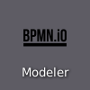

# Summary: Hello World

*It's often the first, but it also works as the last.*

Let's summarize from the very beginning, how to build and execute a minimal dummy BPMN process where Zeebe is used to orchestrate Robot Framework.

```{bpmn-figure} hello-world
It's the time for Hello World!

Process: {download}`hello-world.bpmn`</br>
Robot: {download}`hello-world.zip`
```

## Start Camunda Modeler



## Choose Camunda 8 BPMN


## Draw minimal process flow


## Configure the service task


## Deploy model definition

The playground Zeebe matches *Camunda Platform 8 Self-Managed* with Cluster endpoint `http://localhost:26500` and *Authentication: None*.


## Start new process instance


## Open Zeebe Play


## Choose deployments


## Choose your deployment


## Choose the started instance


## See how task is waiting


## Open Robocorp Code


## On the first run, wait...


## Create new robot


## Choose standard template


## Confirm children in workspace


## Give robot a name


## Align robot.yml with BPMN


Update `tasks:` to have a task with your service task definition type `Hello World` and map it to the default task in the standard template in its tasks.robot with `robotTaskName: Minimal task`.

```yaml
tasks:
  # Task names here are used when executing the bots, so renaming these is recommended.
  Hello World:
    robotTaskName: Minimal task

condaConfigFile: conda.yaml

environmentConfigs:
  - environment_windows_amd64_freeze.yaml
  - environment_linux_amd64_freeze.yaml
  - environment_darwin_amd64_freeze.yaml
  - conda.yaml

artifactsDir: output  

PATH:
  - .
PYTHONPATH:
  - .

ignoreFiles:
  - .gitignore

# For more details on the format and content:

# https://github.com/robocorp/rcc/blob/master/docs/recipes.md#what-is-in-robotyaml
```

## Wrap robot

With **Open Robot Terminal** and typing `wrap`, the playground alias for `rcc robot wrap`.


## Start RCC


## Watch RCC warming up


## Watch RCC working


## Open the log file link


## Return to Zeebe Play


That's all! It's time to congratulate yourself!

