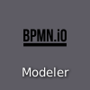
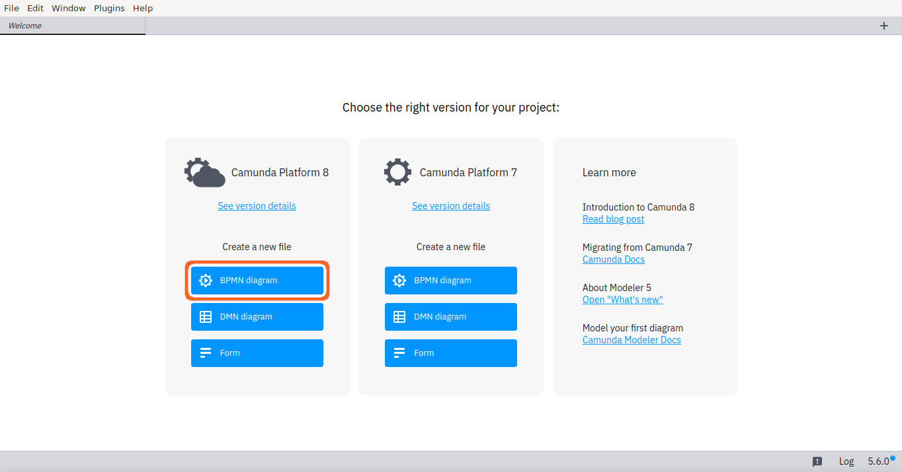
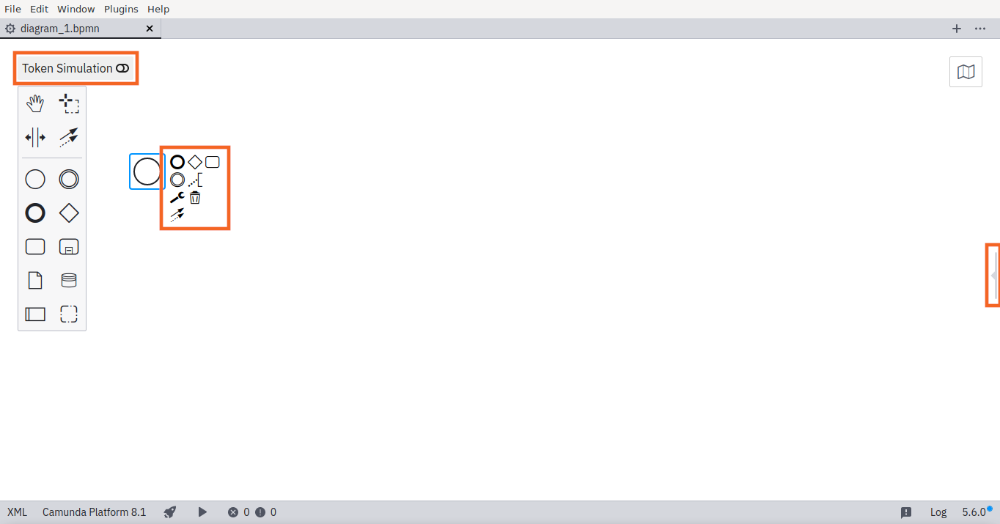

# BPMN exercises

Once learning [the basics of BPMN](../bpmn) it is now time to practice. Please, open **Camunda Modeler** from the desktop



and choose **Camunda Platform 8 BPMN diagram** from its welcome screen



and almost ready to begin. Just make sure that you find the following important elements from the modeler user interface:



1. **Token Simulation toggle** just above the main modeling palette. Leave it off, but be ready to use it for these exercises.

2. Element **context modeling palette**, which is visible, when you select an element, like the {bpmn}`../bpmn/start-event` **Start event**. It's priceless for efficient modeling.

3. **Properties panel toggle** from the right side of the modeler (or on the left border of the panel when itis open). Please, **keep the panel closed for these exercises**.

Now you are ready to practice.


## Sequence flow

1. Start with a **simple flow** with multiple {bpmn}`../bpmn/task` tasks in sequence from {bpmn}`../bpmn/start-event` start to {bpmn}`../bpmn/end-event` end.
2. Toggle **Token Simulation** to observe, how each token flows through the process one task at time.
3. While on the simulator, hover on a task to **toggle pause** on a task.
4. Observe, how token stops an tasks wait waits for you to **release it with play** button on a task.

```{bpmn-figure} simple-flow
{download}`simple-flow.bpmn`
```

## Exclusive paths

1. Model a flow that splits and joins with {bpmn}`../bpmn/exclusive-gateway` **exclusive gateways** (clear diamond symbol on the palette).
2. **Toggle Simulation** to observe, how tokens choose their path on splits and join.
3. While on the simulator, use **switch button** on the gateways to change the path.

```{bpmn-figure} exclusive-paths
{download}`exclusive-paths.bpmn`
```

## Concurrent paths

1. Re-use the model from the previous exercise.
2. One at time, choose the {bpmn}`../bpmn/exclusive-gateway` exlusive gateways on your diagram and use their **context modeling palettes** to turn them into {bpmn}`../bpmn/parallel-gateway` parallel gateways.
3. **Toggle Simulation** to observe, how tokens multiple on splits and merge back in joins.
4. While on the simulator,  **toggle pause** on tasks to observe, how joining gateways wait for all incoming paths before letting merged token to continue.
5. Turn the first {bpmn}`../bpmn/parallel-gateway` parallel gateway back to {bpmn}`../bpmn/exclusive-gateway` exclusive gateway and simulate. What happens at the joining gateways? Why?

```{bpmn-figure} concurrent-paths
{download}`concurrent-paths.bpmn`
```

## Multiple end-events

1. Re-use the model from the previous exercise.
2. Replace some of the joining {bpmn}`../bpmn/parallel-gateway` parallel gateways with additional {bpmn}`../bpmn/end-event` end events.
3. **Toggle Simulation** to observe, how the process completes only when all parallelized tokens have reached to at least some of the end events.
4. While on the simulator, **toggle pause** on tasks to observe even easier, how completion of the process is delayed, even some tokens reach end events at their paths.

```{bpmn-figure} multiple-end-events
{download}`multiple-end-events.bpmn`
```

## to becontinued...
